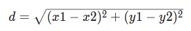

## 1.2.2. Расстояние между точками

Напишите программу, которая рассчитает евклидово расстояние между точками на плоскости (x1, y1) и (x2, y2):


___
**Напишите программу. Тестируется через stdin → stdout**

**Time Limit:** 8 секунд

**Memory Limit:** 256 MB
___
**Sample Input:**
> **1 1 4 5**

**Sample Output:**
> **5**
___

```Go
package main

import (
	"fmt"
	"math"
)

func main() {
	// объявите переменные x1, y1, x2, y2 типа float64
	var ...

	// считываем числа из os.Stdin
	// гарантируется, что значения корректные
	// не меняйте этот блок
	fmt.Scan(&x1, &y1, &x2, &y2)

	// рассчитайте d по формуле эвклидова расстояния
	// используйте math.Pow(x, 2) для возведения в квардрат
	// используйте math.Sqrt(x) для извлечения корня
	d := ...

	// выводим результат в os.Stdout
	fmt.Println(d)
}
```